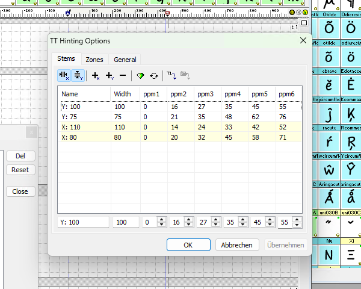
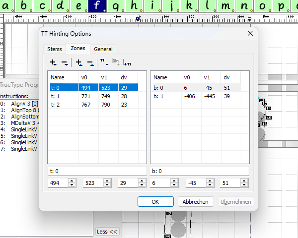
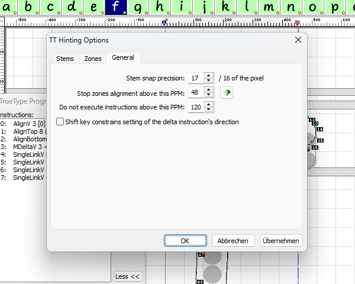
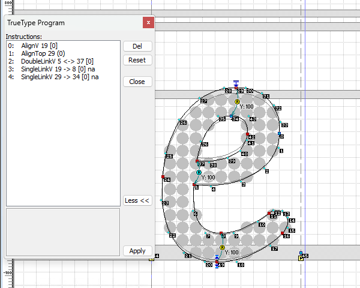
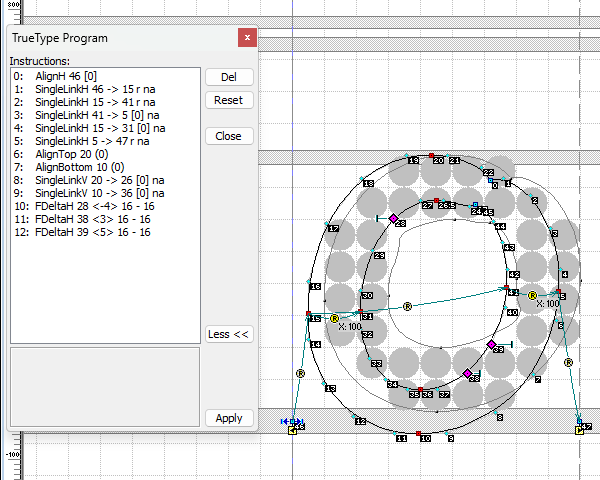
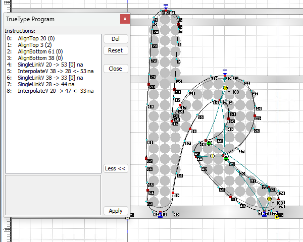
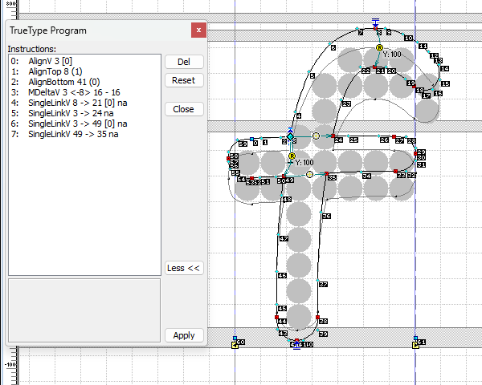

# Notes on TrueType hinting with FontLab Studio 5

Based on research done in March 2016

## In praise of FontLab Studio 5’s TrueType hinting interface

I’ve long maintained the opinion that FontLab Studio 5 has an excellent interface for hinting TrueType fonts. TrueType, as you may know, implements its own assembly language that can influence the rasterization and thus the screen display quality of fonts.

FLS5 (and probably its predecessors, I wasn’t around then) comes with a pre-defined set of TrueType functions, and an interface that makes TrueType hinting look very much like PostScript hinting, but with added control. This is not a simple task to accomplish.

As font wide settings, FLS5 gives the user control over _Stems, Zones,_ and _General,_ which don’t exist under these names in the TrueType engine. FLS5 invented them on top of the TrueType language to make hinting more accessible.

Compare and contrast FLS5’s interface with Visual TrueType, which is basically a code editor with a graphical preview.


## Font-wide settings

### Stems



In this tab of the TT Hinting Options window, the user can define horizontal and vertical stems. Their width will be used by FLS5 to automatically match stems to the glyphs while doing manual glyph hinting. The ppm columns define from which ppm (pixels per em) font size the stem will be 1, 2, 3, 4, 5, and 6 pixels wide. This applies to the _black and white_ and _greyscale_ rendering modes for the x and y directions, and only to the y direction in ClearType GDI rendering. In ClearType rendering, points on the x-axis will be positioned using the three red, green, and blue subpixels. Simply put, using subpixels increases the resolution in the x-direction by a factor of 3, and most instructions in this direction apply to the virtual 3x grid, or are ignored altogether. The visible result is, that in ClearType GDI, the “pixel jumps” for x-stems defined here have no effect.

The display of stems can be filtered to only show x or y direction; the plus icons add stems manually, the minus icon removes them, the diamond harmonizes the pixel jumps automatically, the reset icon resets the pixel jumps to their inital calculated state. The T1 arrow imports the stems from the PostScript hinting settings of the current file, while the folder icon imports the stems from another file.

### Zones



In this tab, important vertical heights are defined, to which parts of the glyph contours will be aligned, like baseline, x-height, cap height, and so on, each paired with another vertical position that should fit the glyphs’ overshoot amount. In the left half are the “top” zones, which are used on the top sides of the outlines, and in the right half are the “bottom” zones, which are used to align the bottom sides. In the binary font, those both kinds of zones are not handled differently, though.

Again, those values can be added and deleted manually, or copied from the PostScript “blue zones”, or copied from another file.

### General



The “General” options tab holds three important settings.

“Stem snap precision” defines the maximum difference between a point’s distance from another point up until which it will be forced to the pixel value defined under “Stems”. The value is given as sixteenths of a pixel.

“Stop zones alignment above this PPM” defines the font size below which a point hinted with a “zone anchor” will be aligned to the zone’s scaled and rounded pixel value. Above that font size, the point will be freely rounded to the nearest vertical pixel boundary of the grid.

“Do not execute instructions above this PPM” defines the font size above which the TrueType hints will be completely deactivated. This makes sense because when you look at the “Stems” tab, you can control the stem widths only up to a certain font size, i.e. the size at which they reach 6 pixels width. In the example font shown above, this is the case at 55 ppm. Above that, you can’t control the pixel width, and thus the hinting should not be active to avoid distortions in the letter shapes. The value of 120 ppm shown in this example is probably too high.

### Translating to assembly/bytecode

The TT Hinting Options window contains the values that are used to build 3 tables in the font:

- [The Control Value Table](prep.md#the-control-value-table), cvt
- [The Pre-Program table](prep.md#the-pre-program), prep
- [The Font Program table](fpgm.md), fpgm

For these tables, there is nothing in FLS5 or a VFB file that resembles source code.

## Glyph-level hinting

TrueType “hints” are also called _instructions,_ but as FLS5 uses a higher-level representation of the actual instructions, and only creates the instruction byte code when the font is compiled, calling the process _hinting_ inside FLS5 is probably fine.

FLS5 only uses a limited set of hints or “commands”, as they are called in the [FLS5 Python API](http://www.e-font.de/flpydoc/):

### Align to Grid: AlignH and AlignV

Those commands round a point’s position to the grid in either horizontal or vertical direction. They have rounding options which allow to round the position of the point to the closest grid line, up or down to the grid (for AlignV), left or right to the grid (for AlignH), to the closest pixel center, or to the grid at double resolution.

### Align to Zone: AlignBottom and AlignTop

Those align a point vertically to a “zone” (bottom or top zone). Above the “stop zones” ppm set in the General options, the point rounds vertically to the closest grid line.

### Single Link: SingleLinkH and SingleLinkV

Those commands maintain a distance between a hinted point and another point. When adding Single Links in the GUI, an Align command is added to the first point if it is not the target point of another command already. A Single Link may refer to a “stem” or not, may enlarge the distance to full pixels, and the target point may itself be rounded to the grid using the options described under _Align to Grid._

### Double Link: DoubleLinkH and DoubleLinkV

For a stem defined by two points in either horizontal or vertical direction, move the point that is alreay closest to a grid line to that grid line, and if the Double Link refers to a “stem”, maintain the stem’s distance by moving the other point accordingly. If no stem is referenced, the second point is moved so that its distance from the first point is greater than 0, and a multiple of 1 pixel.

### Interpolate: InterpolateH and InterpolateV

These commands define two reference points, and move a third point so that the relation of the distance from the point to the referece points in the original unhinted outline is kept the same in the scaled and hinted outline. The third point may be rounded to the grid, using the options described under _Align to Grid._

### Middle Delta: MDeltaH and MDeltaV

These commands move a point by a specified amount (in eigths of a pixel, between -1 and 1 pixel) in a defined range of ppms.

### Final Delta: FDeltaH and FDeltaV

These commands also move a point by a specified amount (in eigths of a pixel, between -1 and 1 pixel) in a defined range of ppms. In contrast to MDeltaH and MDeltaV, these “Final Delta” operations are peformed after all other commands have been applied.

## Example Glyphs

Let’s look at some examples.



In addition to the command symbols in the outline view, you can view the commands as text in the “TrueType Program” window:

<table>
    <tr><th>Command</th></tr>
    <tr><td>AlignV 19 [0]</td></tr>
    <tr><td>AlignTop 29 (0)</td></tr>
    <tr><td>DoubleLinkV 5 <-> 37 [0]</td></tr>
    <tr><td>SingleLinkV 19 -> 8 [0] na</td></tr>
    <tr><td>SingleLinkV 29 -> 34 [0] na</td></tr>
</table>

The number(s) after the command name are the index(es) of the point(s) in the outline the command refers to. After that, references to stems and zones, and rounding options follow.

Annotated:

<table>
    <tr><th>Command</th><th>Meaning</th></tr>
    <tr><td>AlignV 19 [0]</td><td>Align point 19 to the grid, 0: using the closest grid line</td></tr>
    <tr><td>AlignTop 29 (0)</td><td>Align point 29 to a zone, 0: using top zone index 0, the x-height zone</td></tr>
    <tr><td>DoubleLinkV 5 <-> 37 [0]</td><td>Double link between points 5 and 37, 0: make the distance equal to y-stem index 0</td></tr>
    <tr><td>SingleLinkV 19 -> 8 [0] na</td><td>Single link from point 19 to 8, 0: make the distance equal to y-stem index 0, na: no additional rounding</td></tr>
    <tr><td>SingleLinkV 29 -> 34 [0] na</td><td>Single link from point 29 to 34, 0: make the distance equal to y-stem index 0, na: no additional rounding</td></tr>
</table>

When we convert the VFB to UFO using `vfb2ufo`, this program looks like this:

```xml
  <ttProgram>
    <ttc code="alignv" point="av01" align="round"/>
    <ttc code="alignt" point="at01" zone="t: 0"/>
    <ttc code="doublev" point1="dv01" point2="dv02" stem="Y: 100"/>
    <ttc code="singlev" point1="av01" point2="sv01" stem="Y: 100"/>
    <ttc code="singlev" point1="at01" point2="sv02" stem="Y: 100"/>
  </ttProgram>
```

As we can see, the point, stem, and zone indexes have been replaced by symbolic names. The point names are stored in the referenced point’s `name` attribute in the UFO representation.

### Translating to assembly/bytecode

When we look at the instruction bytecode for this glyph in a hex editor, we find this:

```
00 b8 00 13 2f b8 00 00 45 58 b8 00 1d 2f 1b b9
00 1d 00 07 3e 59 bb 00 25 00 01 00 05 00 04 2b
b8 00 13 10 b9 00 08 00 01 f4 b8 00 1d 10 b9 00
22 00 01 f4 30 31
```

Not very human-readable. Let’s try to decompile it to [TrueType assembly](https://learn.microsoft.com/en-us/typography/opentype/spec/tt_instructions):

<table>
    <tr><th>Hex</th><th>Assembly</th><th>Meaning</th>
    </tr>
    <tr><td>00</td><td>SVTCA[0]</td><td>The following instructions will affect the vertical direction</td></tr>
    <tr><td>b8</td><td>PUSHW[ ]</td><td>Read 1 word and push it to the stack</td></tr>
    <tr><td>0013</td><td>19</td><td>data</td></tr>
    <tr><td>2f</td><td>MDAP[1]</td><td>Round point 19 to the grid</td></tr>
    <tr><td>b8</td><td>PUSHW[ ]</td><td>Read 1 word and push it to the stack</td></tr>
    <tr><td>0000</td><td>0</td><td>data</td></tr>
    <tr><td>45</td><td>RCVT[ ]</td><td>Read CVT index 0 and push the result to the stack</td></tr>
    <tr><td>58</td><td>IF[ ]</td><td>If the value on the stack represents TRUE</td></tr>
    <tr><td>b8</td><td>&nbsp;&nbsp;&nbsp;&nbsp;PUSHW[ ]</td><td>Read 1 word and push it to the stack</td></tr>
    <tr><td>001d</td><td>&nbsp;&nbsp;&nbsp;&nbsp;29</td><td>data</td></tr>
    <tr><td>2f</td><td>&nbsp;&nbsp;&nbsp;&nbsp;MDAP[1]</td><td>Round point 29 to the grid</td></tr>
    <tr><td>1b</td><td>ELSE[ ]</td><td>else</td></tr>
    <tr><td>b9</td><td>&nbsp;&nbsp;&nbsp;&nbsp;PUSHW[ ]</td><td>Read 2 words and push them to the stack</td></tr>
    <tr><td>001d</td><td>&nbsp;&nbsp;&nbsp;&nbsp;29</td><td>data</td></tr>
    <tr><td>0007</td><td>&nbsp;&nbsp;&nbsp;&nbsp;7</td><td>data</td></tr>
    <tr><td>3e</td><td>&nbsp;&nbsp;&nbsp;&nbsp;MIAP[0]</td><td>Move point 29 to the value in CVT index 7</td></tr>
    <tr><td>59</td><td>EIF[ ]</td><td>End of conditional</td></tr>
    <tr><td>bb</td><td>PUSHW[ ]</td><td>Read 4 words and push them to the stack</td></tr>
    <tr><td>0025</td><td>37</td><td>data</td></tr>
    <tr><td>0001</td><td>1</td><td>data</td></tr>
    <tr><td>0005</td><td>5</td><td>data</td></tr>
    <tr><td>0004</td><td>4</td><td>data</td></tr>
    <tr><td>2b</td><td>CALL[ ]</td><td><a href="fdef4.md">CallFunction 4</a>, which will consume the values 37, 1, 5 from the stack</td></tr>
    <tr><td>b8</td><td>PUSHW[ ]</td><td>Read 1 word and push it to the stack</td></tr>
    <tr><td>0013</td><td>19</td><td>data</td></tr>
    <tr><td>10</td><td>SRP0[ ]</td><td>Make point 19 the reference point</td></tr>
    <tr><td>b9</td><td>PUSHW[ ]</td><td>Read 2 words and push them to the stack</td></tr>
    <tr><td>0008</td><td>8</td><td>data</td></tr>
    <tr><td>0001</td><td>1</td><td>data</td></tr>
    <tr><td>f4</td><td>MIRP[10100]</td><td>Make the distance from the reference point (19) to point 8 equal to the value in CVT index 1</td></tr>
    <tr><td>b8</td><td>PUSHW[ ]</td><td>Read 1 word and push it to the stack</td></tr>
    <tr><td>001d</td><td>29</td><td>data</td></tr>
    <tr><td>10</td><td>SRP0[ ]</td><td>Make point 29 the reference point</td></tr>
    <tr><td>b9</td><td>PUSHW[ ]</td><td>Read 2 words and push them to the stack</td></tr>
    <tr><td>0022</td><td>34</td><td>data</td></tr>
    <tr><td>0001</td><td>1</td><td>data</td></tr>
    <tr><td>f4</td><td>MIRP[10100]</td><td>Make the distance from the reference point (29) to point 8 equal to the value in CVT index 1</td></tr>
    <tr><td>30</td><td>IUP[0]</td><td>Interpolate untouched points in y direction</td></tr>
    <tr><td>31</td><td>IUP[1]</td><td>Interpolate untouched points in x direction</td></tr>
</table>

    Did you notice that all data has been stored in the instruction stream as 2-byte words? There’s also a PUSHB[] instruction that reads bytes, and all data in this example could have been stored in bytes. If applied throughout the font, such optimization could reduce the file size a bit.

Now, after looking long and hard at the code, we find that each of the FLS5 TrueType commands corresponds to a series of assembly instructions. Let’s try to match them all!

<table>
    <tr><th>Command</th><th>Assembly</th><th>Meaning</th>
    </tr>
    <tr><td></td><td>SVTCA[0]</td><td>The following instructions will affect the vertical direction</td></tr>
    <tr><td rowspan="3">AlignV 19 [0]</td><td>PUSHW[ ]</td><td>Read 1 word and push it to the stack</td></tr>
    <tr><td>19</td><td>point index</td></tr>
    <tr><td>MDAP[1]</td><td>Round point 19 to the grid</td></tr>
    <tr><td rowspan="13">AlignTop 29 (0)</td><td>PUSHW[ ]</td><td>Read 1 word and push it to the stack</td></tr>
    <tr><td>0</td><td><em>Are the zones active? (CVT index 0)</em></td></tr>
    <tr><td>RCVT[ ]</td><td>Read CVT index 0 and push the result to the stack</td></tr>
    <tr><td>IF[ ]</td><td>If the value on the stack represents TRUE</td></tr>
    <tr><td>&nbsp;&nbsp;&nbsp;&nbsp;PUSHW[ ]</td><td>Read 1 word and push it to the stack</td></tr>
    <tr><td>&nbsp;&nbsp;&nbsp;&nbsp;29</td><td>point index</td></tr>
    <tr><td>&nbsp;&nbsp;&nbsp;&nbsp;MDAP[1]</td><td>Round point 29 to the grid</td></tr>
    <tr><td>ELSE[ ]</td><td>else</td></tr>
    <tr><td>&nbsp;&nbsp;&nbsp;&nbsp;PUSHW[ ]</td><td>Read 2 words and push them to the stack</td></tr>
    <tr><td>&nbsp;&nbsp;&nbsp;&nbsp;29</td><td>point index</td></tr>
    <tr><td>&nbsp;&nbsp;&nbsp;&nbsp;7</td><td>zone index in CVT</td></tr>
    <tr><td>&nbsp;&nbsp;&nbsp;&nbsp;MIAP[0]</td><td>Move point 29 to the value in CVT index 7</td></tr>
    <tr><td>EIF[ ]</td><td>End of conditional</td></tr>
    <tr><td rowspan="6">DoubleLinkV 5 <-> 37 [0]</td><td>PUSHW[ ]</td><td>Read 4 words and push them to the stack</td></tr>
    <tr><td>37</td><td>point index</td></tr>
    <tr><td>1</td><td>stem index in CVT</td></tr>
    <tr><td>5</td><td>point index</td></tr>
    <tr><td>4</td><td>function index</td></tr>
    <tr><td>CALL[ ]</td><td><a href="fdef4.md">CallFunction 4</a>, which will consume the values 37, 1, 5 from the stack</td></tr>
    <tr><td rowspan="7">SingleLinkV 19 -> 8 [0] na</td><td>PUSHW[ ]</td><td>Read 1 word and push it to the stack</td></tr>
    <tr><td>19</td><td>point index</td></tr>
    <tr><td>SRP0[ ]</td><td>Make point 19 the reference point</td></tr>
    <tr><td>PUSHW[ ]</td><td>Read 2 words and push them to the stack</td></tr>
    <tr><td>8</td><td>point index</td></tr>
    <tr><td>1</td><td>stem index in CVT</td></tr>
    <tr><td>MIRP[10100]</td><td>Make the distance from the reference point (19) to point 8 equal to the value in CVT index 1</td></tr>
    <tr><td rowspan="7">SingleLinkV 29 -> 34 [0] na</td><td>PUSHW[ ]</td><td>Read 1 word and push it to the stack</td></tr>
    <tr><td>29</td><td>point index</td></tr>
    <tr><td>SRP0[ ]</td><td>Make point 29 the reference point</td></tr>
    <tr><td>PUSHW[ ]</td><td>Read 2 words and push them to the stack</td></tr>
    <tr><td>34</td><td>point index</td></tr>
    <tr><td>1</td><td>stem index in CVT</td></tr>
    <tr><td>MIRP[10100]</td><td>Make the distance from the reference point (29) to point 34 equal to the value in CVT index 1</td></tr>
    <tr><td></td><td>IUP[0]</td><td>Interpolate untouched points in y direction</td></tr>
    <tr><td></td><td>IUP[1]</td><td>Interpolate untouched points in x direction</td></tr>
</table>

It’s just a little confusing that the indexes in the high-level commands are refering to the index of stems and zones in the FLS5 interface, while the indexes in the actual instructions refer to the compiled Control Value Table.

    The zone alignment code (AlignBottom, AlignTop) is very verbose, and could be moved into a function. That would save file size in the glyph programs.

The e only contains vertical hinting, which is usually enough, but let’s look at an example with both horizontal and vertical hinting. FLS5 only displays one direction at a time, though.



<table>
    <tr><th>Command</th><th>Meaning</th></tr>
    <tr><td>AlignH 46 [0]</td><td>Align point 46 to the grid, 0: using the closest grid line</td></tr>
    <tr><td>SingleLinkH 46 -> 15 r na</td><td>Single link from point 46 to 15, r: round the distance, na: no additional rounding</td></tr>
    <tr><td>SingleLinkH 15 -> 41 r na</td><td>Single link from point 15 to 41, r: round the distance, na: no additional rounding</td></tr>
    <tr><td>SingleLinkH 41 -> 5 [0] na</td><td>Single link from point 41 to 5, 0: make the distance equal to x-stem index 0, na: no additional rounding</td></tr>
    <tr><td>SingleLinkH 15 -> 31 [0] na</td><td>Single link from point 15 to 31, 0: make the distance equal to x-stem index 0, na: no additional rounding</td></tr>
    <tr><td>SingleLinkH 5 -> 47 r na</td><td>Single link from point 5 to 47, r: round the distance, na: no additional rounding</td></tr>
    <tr><td>AlignTop 20 (0)</td><td>Align point 20 to a zone, 0: using top zone index 0, the x-height zone</td></tr>
    <tr><td>AlignBottom 10 (0)</td><td>Align point 10 to a zone, 0: using bottom zone index 0, the baseline zone</td></tr>
    <tr><td>SingleLinkV 20 -> 26 [0] na</td><td>Single link from point 20 to 26, 0: make the distance equal to y-stem index 0, na: no additional rounding</td></tr>
    <tr><td>SingleLinkV 10 -> 36 [0] na</td><td>Single link from point 10 to 36, 0: make the distance equal to y-stem index 0, na: no additional rounding</td></tr>
    <tr><td>FDeltaH 28 <-4> 16 - 16</td><td>Move point 28 by -4/8 pixels, 16: starting at 16 ppm, 16: ending at 16 ppm</td></tr>
    <tr><td>FDeltaH 38 <3> 16 - 16</td><td>Move point 38 by 3/8 pixels, 16: starting at 16 ppm, 16: ending at 16 ppm</td></tr>
    <tr><td>FDeltaH 39 <5> 16 - 16</td><td>Move point 39 by 5/8 pixels, 16: starting at 16 ppm, 16: ending at 16 ppm</td></tr>
</table>

Here we can see that the LSB (left sidebearing) and RSB (right sidebearing) points can be targeted by commands as well. Their indexes, in this example 46 and 47, are counted after the point indexes of the outline.

Correlated to the assembly code:

<table>
    <tr><th>Command</th><th>Assembly</th><th></th></tr>
    <tr><td rowspan="3">AlignH 46 [0]</td><td>PUSHW[ ]</td><td>1 value pushed</td></tr>
        <tr><td>46</td><td><em>point index</em></td></tr>
        <tr><td>MDAP[1]</td><td>MoveDirectAbsPt</td></tr>
    <tr><td rowspan="3">SingleLinkH 46 -> 15 r na</td><td>PUSHW[ ]</td><td>1 value pushed</td></tr>
        <tr><td>15</td><td><em>point2 index</em></td></tr>
        <tr><td>MDRP[11100]</td><td>MoveDirectRelPt</td></tr>
    <tr><td rowspan="3">SingleLinkH 15 -> 41 r na</td><td>PUSHW[ ]</td><td>1 value pushed</td></tr>
        <tr><td>41</td><td><em>point2 index</em></td></tr>
        <tr><td>MDRP[11100]</td><td>MoveDirectRelPt</td></tr>
    <tr><td rowspan="3">SingleLinkH 41 -> 5 [0] na</td><td>PUSHW[ ]</td><td>2 values pushed</td></tr>
        <tr><td>5 2</td><td><em>point2 index, stem index in CVT</em></td></tr>
        <tr><td>MIRP[10100]</td><td>MoveIndirectRelPt</td></tr>
    <tr><td rowspan="6">SingleLinkH 15 -> 31 [0] na</td><td>PUSHW[ ]</td><td>1 value pushed</td></tr>
        <tr><td>15</td><td><em>point1 index</em></td></tr>
        <tr><td>SRP0[ ]</td><td>SetRefPoint0</td></tr>
        <tr><td>PUSHW[ ]</td><td>2 values pushed</td></tr>
        <tr><td>31 2</td><td><em>point2 index, stem index in CVT</em></td></tr>
        <tr><td>MIRP[10100]</td><td>MoveIndirectRelPt</td></tr>
    <tr><td rowspan="6">SingleLinkH 5 -> 47 r na</td><td>PUSHW[ ]</td><td>1 value pushed</td></tr>
        <tr><td>5</td><td><em>point1 index</em></td></tr>
        <tr><td>SRP0[ ]</td><td>SetRefPoint0</td></tr>
        <tr><td>PUSHW[ ]</td><td>1 value pushed</td></tr>
        <tr><td>47</td><td><em>point2 index</em></td></tr>
        <tr><td>MDRP[11100]</td><td>MoveDirectRelPt</td></tr>
    <tr><td></td><td>SVTCA[0]</td><td>SetFPVectorToAxis</td></tr>
    <tr><td rowspan="12">AlignTop 20 (0)</td><td>PUSHW[ ]</td><td>1 value pushed</td></tr>
        <tr><td>0</td><td><em>zones active? (CVT index 0)</em></td></tr>
        <tr><td>RCVT[ ]</td><td>ReadCVT</td></tr>
        <tr><td>IF[ ]</td><td>If</td></tr>
        <tr><td>&nbsp;&nbsp;&nbsp;&nbsp;PUSHW[ ]</td><td>1 value pushed</td></tr>
        <tr><td>&nbsp;&nbsp;&nbsp;&nbsp;20</td><td><em>point index</em></td></tr>
        <tr><td>&nbsp;&nbsp;&nbsp;&nbsp;MDAP[1]</td><td>MoveDirectAbsPt</td></tr>
        <tr><td>ELSE[ ]</td><td>Else</td></tr>
        <tr><td>&nbsp;&nbsp;&nbsp;&nbsp;PUSHW[ ]</td><td>2 values pushed</td></tr>
        <tr><td>&nbsp;&nbsp;&nbsp;&nbsp;20 7</td><td><em>point2 index, zone index in CVT</em></td></tr>
        <tr><td>&nbsp;&nbsp;&nbsp;&nbsp;MIAP[0]</td><td>MoveIndirectAbsPt</td></tr>
        <tr><td>EIF[ ]</td><td>EndIf</td></tr>
    <tr><td rowspan="12">AlignBottom 10 (0)</td><td>PUSHW[ ]</td><td>1 value pushed</td></tr>
        <tr><td>0</td><td><em>zones active? (CVT index 0)</em></td></tr>
        <tr><td>RCVT[ ]</td><td>ReadCVT</td></tr>
        <tr><td>IF[ ]</td><td>If</td></tr>
        <tr><td>&nbsp;&nbsp;&nbsp;&nbsp;PUSHW[ ]</td><td>1 value pushed</td></tr>
        <tr><td>&nbsp;&nbsp;&nbsp;&nbsp;10</td><td><em>point index</em></td></tr>
        <tr><td>&nbsp;&nbsp;&nbsp;&nbsp;MDAP[1]</td><td>MoveDirectAbsPt</td></tr>
        <tr><td>ELSE[ ]</td><td>Else</td></tr>
        <tr><td>&nbsp;&nbsp;&nbsp;&nbsp;PUSHW[ ]</td><td>2 values pushed</td></tr>
        <tr><td>&nbsp;&nbsp;&nbsp;&nbsp;10 3</td><td><em>point2 index, zone index in CVT</em></td></tr>
        <tr><td>&nbsp;&nbsp;&nbsp;&nbsp;MIAP[0]</td><td>MoveIndirectAbsPt</td></tr>
        <tr><td>EIF[ ]</td><td>EndIf</td></tr>
    <tr><td rowspan="6">SingleLinkV 20 -> 26 [0] na</td><td>PUSHW[ ]</td><td>1 value pushed</td></tr>
        <tr><td>20</td><td><em>point1 index</em></td></tr>
        <tr><td>SRP0[ ]</td><td>SetRefPoint0</td></tr>
        <tr><td>PUSHW[ ]</td><td>2 values pushed</td></tr>
        <tr><td>26 1</td><td><em>point2 index, stem index in CVT</em></td></tr>
        <tr><td>MIRP[10100]</td><td>MoveIndirectRelPt</td></tr>
    <tr><td rowspan="6">SingleLinkV 10 -> 36 [0] na</td><td>PUSHW[ ]</td><td>1 value pushed</td></tr>
        <tr><td>10</td><td><em>point1 index</em></td></tr>
        <tr><td>SRP0[ ]</td><td>SetRefPoint0</td></tr>
        <tr><td>PUSHW[ ]</td><td>2 values pushed</td></tr>
        <tr><td>36 1</td><td><em>point2 index, stem index in CVT</em></td></tr>
        <tr><td>MIRP[10100]</td><td>MoveIndirectRelPt</td></tr>
    <tr><td></td><td>IUP[0]</td><td>InterpolateUntPts</td></tr>
    <tr><td></td><td>IUP[1]</td><td>InterpolateUntPts</td></tr>
    <tr><td></td><td>SVTCA[1]</td><td>SetFPVectorToAxis</td></tr>
    <tr><td rowspan="3">FDeltaH 28 <-4> 16 - 16</td><td>NPUSHW[ ]</td><td>3 values pushed</td></tr>
        <tr><td>116 28 1</td><td><em>Exception specification, point index, number of spec/point pairs</em></td></tr>
        <tr><td>DELTAP1[ ]</td><td>DeltaExceptionP1</td></tr>
    <tr><td rowspan="3">FDeltaH 38 <3> 16 - 16</td><td>NPUSHW[ ]</td><td>3 values pushed</td></tr>
        <tr><td>122 38 1</td><td><em>Exception specification, point index, number of spec/point pairs</em></td></tr>
        <tr><td>DELTAP1[ ]</td><td>DeltaExceptionP1</td></tr>
    <tr><td rowspan="3">FDeltaH 39 <5> 16 - 16</td><td>NPUSHW[ ]</td><td>3 values pushed</td></tr>
        <tr><td>124 39 1</td><td><em>Exception specification, point index, number of spec/point pairs</em></td></tr>
        <tr><td>DELTAP1[ ]</td><td>DeltaExceptionP1</td></tr>
</table>

The commands are organized so that all x direction instructions come first, then all the y direction instructions, so that the direction switching only has to occur once in the “main” program (it starts with x, being the default direction). The `IUP` (interpolate untouched points) instructions are always added at its end, regardless if there actually were any instructions in each direction.

Note that we here see a Single Link without stem, `SingleLinkH 46 -> 15 r na`. It rounds its distance, indicated by the `r`. It uses the `MDRP` instruction instead of the `MIRP` instruction.

After the `IUP`, any final deltas follow. For those in our example glyph, the direction has to be switched to the x axis again.

The _exception specfication_ value of delta instructions combines the relative ppm and the magnitude of the shift and must be built according to the [OpenType spec for deltas](https://learn.microsoft.com/en-us/typography/opentype/spec/tt_instructions#managing-exceptions). The delta_base value is set in [function 0](fdef0.md).

Why are some Singe Links 6 instructions long, and some just 3 instructions long? Single Links use the “reference point 0” (a property of the TrueType engine’s [Graphics State](https://learn.microsoft.com/en-us/typography/opentype/spec/tt_graphics_state)) which is set by some instructions, and used by other instructions. FLS5 keeps track of the current reference point and only sets it explicitly when necessary.

Actually there are three reference points (rp0, rp1, rp2). They are set and used by different instructions, sometimes depending on flags passed to the instruction.

Let’s find another example for more different commands.



<table>
    <tr><th>Command</th><th>Meaning</th>
    <tr><td>AlignTop 20 (0)</td><td>Align point 20 to a zone, 0: using top zone index 0, the x-height zone</td></tr>
    <tr><td>AlignTop 3 (2)</td><td>Align point 3 to a zone, 2: using top zone index 2, the ascender zone</td></tr>
    <tr><td>AlignBottom 61 (0)</td><td>Align point 61 to a zone, 0: using bottom zone index 0, the baseline zone</td></tr>
    <tr><td>AlignBottom 38 (0)</td><td>Align point 38 to a zone, 0: using bottom zone index 0, the baseline zone</td></tr>
    <tr><td>SingleLinkV 20 -> 53 [0] na</td><td>Single link from point 20 to 53, 0: make the distance equal to y-stem index 0, na: no additional rounding</td></tr>
    <tr><td>InterpolateV 38 -> 28 <- 53 na</td><td>Interpolate point 28 between points 38 and 53, na: no additional rounding</td></tr>
    <tr><td>SingleLinkV 38 -> 33 [0] na</td><td>Single link from point 38 to 33, 0: make the distance equal to y-stem index 0, na: no additional rounding</td></tr>
    <tr><td>SingleLinkV 28 -> 44 na</td><td>Single link from point 28 to 44, na: no additional rounding</td></tr>
    <tr><td>InterpolateV 20 -> 47 <- 33 na</td><td>Interpolate point 28 between points 20 and 33, na: no additional rounding</td></tr>
</table>

<table>
    <tr><th>Command</th><th>Assembly</th><th></th>
    </tr>
    <tr><td></td><td>SVTCA[0]</td><td>SetFPVectorToAxis</td></tr>
    <tr><td rowspan="12">AlignTop 20 (0)</td><td>PUSHW[ ]</td><td>1 value pushed</td></tr>
    <tr><td>0</td><td><em>zones active? (CVT index 0)</em></td></tr>
    <tr><td>RCVT[ ]</td><td>ReadCVT</td></tr>
    <tr><td>IF[ ]</td><td>If</td></tr>
    <tr><td>&nbsp;&nbsp;&nbsp;&nbsp;PUSHW[ ]</td><td>1 value pushed</td></tr>
    <tr><td>&nbsp;&nbsp;&nbsp;&nbsp;20</td><td><em>point index</em></td></tr>
    <tr><td>&nbsp;&nbsp;&nbsp;&nbsp;MDAP[1]</td><td>MoveDirectAbsPt</td></tr>
    <tr><td>ELSE[ ]</td><td>Else</td></tr>
    <tr><td>&nbsp;&nbsp;&nbsp;&nbsp;PUSHW[ ]</td><td>2 values pushed</td></tr>
    <tr><td>&nbsp;&nbsp;&nbsp;&nbsp;20 7</td><td><em>point index, zone index in CVT</em></td></tr>
    <tr><td>&nbsp;&nbsp;&nbsp;&nbsp;MIAP[0]</td><td>MoveIndirectAbsPt</td></tr>
    <tr><td>EIF[ ]</td><td>EndIf</td></tr>
    <tr><td rowspan="12">AlignTop 3 (2)</td><td>PUSHW[ ]</td><td>1 value pushed</td></tr>
    <tr><td>0</td><td><em>zones active? (CVT index 0)</em></td></tr>
    <tr><td>RCVT[ ]</td><td>ReadCVT</td></tr>
    <tr><td>IF[ ]</td><td>If</td></tr>
    <tr><td>&nbsp;&nbsp;&nbsp;&nbsp;PUSHW[ ]</td><td>1 value pushed</td></tr>
    <tr><td>&nbsp;&nbsp;&nbsp;&nbsp;3</td><td><em>point index</em></td></tr>
    <tr><td>&nbsp;&nbsp;&nbsp;&nbsp;MDAP[1]</td><td>MoveDirectAbsPt</td></tr>
    <tr><td>ELSE[ ]</td><td>Else</td></tr>
    <tr><td>&nbsp;&nbsp;&nbsp;&nbsp;PUSHW[ ]</td><td>2 values pushed</td></tr>
    <tr><td>&nbsp;&nbsp;&nbsp;&nbsp;3 11</td><td><em>point index, zone index in CVT</em></td></tr>
    <tr><td>&nbsp;&nbsp;&nbsp;&nbsp;MIAP[0]</td><td>MoveIndirectAbsPt</td></tr>
    <tr><td>EIF[ ]</td><td>EndIf</td></tr>
    <tr><td rowspan="12">AlignBottom 61 (0)</td><td>PUSHW[ ]</td><td>1 value pushed</td></tr>
    <tr><td>0</td><td><em>zones active? (CVT index 0)</em></td></tr>
    <tr><td>RCVT[ ]</td><td>ReadCVT</td></tr>
    <tr><td>IF[ ]</td><td>If</td></tr>
    <tr><td>&nbsp;&nbsp;&nbsp;&nbsp;PUSHW[ ]</td><td>1 value pushed</td></tr>
    <tr><td>&nbsp;&nbsp;&nbsp;&nbsp;61</td><td><em>point index</em></td></tr>
    <tr><td>&nbsp;&nbsp;&nbsp;&nbsp;MDAP[1]</td><td>MoveDirectAbsPt</td></tr>
    <tr><td>ELSE[ ]</td><td>Else</td></tr>
    <tr><td>&nbsp;&nbsp;&nbsp;&nbsp;PUSHW[ ]</td><td>2 values pushed</td></tr>
    <tr><td>&nbsp;&nbsp;&nbsp;&nbsp;61 3</td><td><em>point index, zone index in CVT</em></td></tr>
    <tr><td>&nbsp;&nbsp;&nbsp;&nbsp;MIAP[0]</td><td>MoveIndirectAbsPt</td></tr>
    <tr><td>EIF[ ]</td><td>EndIf</td></tr>
    <tr><td rowspan="12">AlignBottom 38 (0)</td><td>PUSHW[ ]</td><td>1 value pushed</td></tr>
    <tr><td>0</td><td><em>zones active? (CVT index 0)</em></td></tr>
    <tr><td>RCVT[ ]</td><td>ReadCVT</td></tr>
    <tr><td>IF[ ]</td><td>If</td></tr>
    <tr><td>&nbsp;&nbsp;&nbsp;&nbsp;PUSHW[ ]</td><td>1 value pushed</td></tr>
    <tr><td>&nbsp;&nbsp;&nbsp;&nbsp;38</td><td><em>point index</em></td></tr>
    <tr><td>&nbsp;&nbsp;&nbsp;&nbsp;MDAP[1]</td><td>MoveDirectAbsPt</td></tr>
    <tr><td>ELSE[ ]</td><td>Else</td></tr>
    <tr><td>&nbsp;&nbsp;&nbsp;&nbsp;PUSHW[ ]</td><td>2 values pushed</td></tr>
    <tr><td>&nbsp;&nbsp;&nbsp;&nbsp;38 3</td><td><em>point index, zone index in CVT</em></td></tr>
    <tr><td>&nbsp;&nbsp;&nbsp;&nbsp;MIAP[0]</td><td>MoveIndirectAbsPt</td></tr>
    <tr><td>EIF[ ]</td><td>EndIf</td></tr>
    <tr><td rowspan="6">SingleLinkV 20 -> 53 [0] na</td><td>PUSHW[ ]</td><td>1 value pushed</td></tr>
    <tr><td>20</td><td><em>point1 index</em></td></tr>
    <tr><td>SRP0[ ]</td><td>SetRefPoint0</td></tr>
    <tr><td>PUSHW[ ]</td><td>2 values pushed</td></tr>
    <tr><td>53 1</td><td><em>point2 index, stem index in CVT</em></td></tr>
    <tr><td>MIRP[10100]</td><td>MoveIndirectRelPt</td></tr>
    <tr><td rowspan="5">InterpolateV 38 -> 28 <- 53 na</td><td>PUSHW[ ]</td><td>3 values pushed</td></tr>
    <tr><td>28 38 53</td><td><em>point1 index, point2 index, point3 index</em></td></tr>
    <tr><td>SRP1[ ]</td><td>SetRefPoint1</td></tr>
    <tr><td>SRP2[ ]</td><td>SetRefPoint2</td></tr>
    <tr><td>IP[ ]</td><td>InterpolatePts</td></tr>
    <tr><td rowspan="6">SingleLinkV 38 -> 33 [0] na</td><td>PUSHW[ ]</td><td>1 value pushed</td></tr>
    <tr><td>38</td><td><em>point1 index</em></td></tr>
    <tr><td>SRP0[ ]</td><td>SetRefPoint0</td></tr>
    <tr><td>PUSHW[ ]</td><td>2 values pushed</td></tr>
    <tr><td>33 1</td><td><em>point2 index, stem index in CVT</em></td></tr>
    <tr><td>MIRP[10100]</td><td>MoveIndirectRelPt</td></tr>
    <tr><td rowspan="6">SingleLinkV 28 -> 44 na</td><td>PUSHW[ ]</td><td>1 value pushed</td></tr>
    <tr><td>28</td><td><em>point1 index</em></td></tr>
    <tr><td>SRP0[ ]</td><td>SetRefPoint0</td></tr>
    <tr><td>PUSHW[ ]</td><td>1 value pushed</td></tr>
    <tr><td>44</td><td><em>point2 index</em></td></tr>
    <tr><td>MDRP[10000]</td><td>MoveDirectRelPt</td></tr>
    <tr><td rowspan="5">InterpolateV 20 -> 47 <- 33 na</td><td>PUSHW[ ]</td><td>3 values pushed</td></tr>
    <tr><td>47 20 33</td><td><em>point1 index, point2 index, point3 index</em></td></tr>
    <tr><td>SRP1[ ]</td><td>SetRefPoint1</td></tr>
    <tr><td>SRP2[ ]</td><td>SetRefPoint2</td></tr>
    <tr><td>IP[ ]</td><td>InterpolatePts</td></tr>
    <tr><td></td><td>IUP[0]</td><td>InterpolateUntPts</td></tr>
    <tr><td></td><td>IUP[1]</td><td>InterpolateUntPts</td></tr>
</table>

Here we have yet another Single Link without stem, `SingleLinkV 28 -> 44 na`. It also uses the `MDRP` instruction instead of the `MIRP` instruction, like the Single Link without stem in the previous example, but its flag, especially the rounding flag, are different, `MDRP[10000]` vs. `MDRP[11100]`. See the [OpenType spec for MDRP](https://learn.microsoft.com/en-us/typography/opentype/spec/tt_instructions#move-direct-relative-point) for an explanation of the flags.

Let’s find another example and concentrate on the commands we have not seen already.



<table>
    <tr><th>Command</th><th>Meaning</th>
    <tr><td>AlignV 3 [0]</td><td>Align point 3 to the grid, 0: using the closest grid line</td></tr>
    <tr><td>AlignTop 8 (1)</td><td>Align point 8 to a zone, 1: using top zone index 1, the cap height zone</td></tr>
    <tr><td>AlignBottom 41 (0)</td><td>Align point 41 to a zone, 0: using bottom zone index 0, the baseline zone</td></tr>
    <tr><td>MDeltaV 3 <-8> 16 - 16</td><td>Move point 3 by -8/8 pixels, 16: starting at 16 ppm, 16: ending at 16 ppm</td></tr>
    <tr><td>SingleLinkV 8 -> 21 [0] na</td><td>Single link from point 8 to 21, 0: make the distance equal to y-stem index 0, na: no additional rounding</td></tr>
    <tr><td>SingleLinkV 3 -> 24 na</td><td>Single link from point 3 to 24, na: no additional rounding</td></tr>
    <tr><td>SingleLinkV 3 -> 49 [0] na</td><td>Single link from point 3 to 49, 0: make the distance equal to y-stem index 0, na: no additional rounding</td></tr>
    <tr><td>SingleLinkV 49 -> 35 na</td><td>Single link from point 49 to 35, na: no additional rounding</td></tr>
</table>

<table>
    <tr><th>Command</th><th>Assembly</th><th></th>
    </tr>
    <tr><td></td><td>SVTCA[0]</td><td>SetFPVectorToAxis</td></tr>
    <tr><td rowspan="3">AlignV 3 [0]</td><td>PUSHW[ ]</td><td>1 value pushed</td></tr>
    <tr><td>3</td><td><em>point index</em></td></tr>
    <tr><td>MDAP[1]</td><td>MoveDirectAbsPt</td></tr>
    <tr><td rowspan="12">AlignTop 8 (1)</td><td>PUSHW[ ]</td><td>1 value pushed</td></tr>
    <tr><td>0</td><td><em>zones active? (CVT index 0)</em></td></tr>
    <tr><td>RCVT[ ]</td><td>ReadCVT</td></tr>
    <tr><td>IF[ ]</td><td>If</td></tr>
    <tr><td>&nbsp;&nbsp;&nbsp;&nbsp;PUSHW[ ]</td><td>1 value pushed</td></tr>
    <tr><td>&nbsp;&nbsp;&nbsp;&nbsp;8</td><td><em>point index</em></td></tr>
    <tr><td>&nbsp;&nbsp;&nbsp;&nbsp;MDAP[1]</td><td>MoveDirectAbsPt</td></tr>
    <tr><td>ELSE[ ]</td><td>Else</td></tr>
    <tr><td>&nbsp;&nbsp;&nbsp;&nbsp;PUSHW[ ]</td><td>2 values pushed</td></tr>
    <tr><td>&nbsp;&nbsp;&nbsp;&nbsp;8 9</td><td><em>point index, zone index in CVT</em></td></tr>
    <tr><td>&nbsp;&nbsp;&nbsp;&nbsp;MIAP[0]</td><td>MoveIndirectAbsPt</td></tr>
    <tr><td>EIF[ ]</td><td>EndIf</td></tr>
    <tr><td rowspan="12">AlignBottom 41 (0)</td><td>PUSHW[ ]</td><td>1 value pushed</td></tr>
    <tr><td>0</td><td><em>zones active? (CVT index 0)</em></td></tr>
    <tr><td>RCVT[ ]</td><td>ReadCVT</td></tr>
    <tr><td>IF[ ]</td><td>If</td></tr>
    <tr><td>&nbsp;&nbsp;&nbsp;&nbsp;PUSHW[ ]</td><td>1 value pushed</td></tr>
    <tr><td>&nbsp;&nbsp;&nbsp;&nbsp;41</td><td><em>point index</em></td></tr>
    <tr><td>&nbsp;&nbsp;&nbsp;&nbsp;MDAP[1]</td><td>MoveDirectAbsPt</td></tr>
    <tr><td>ELSE[ ]</td><td>Else</td></tr>
    <tr><td>&nbsp;&nbsp;&nbsp;&nbsp;PUSHW[ ]</td><td>2 values pushed</td></tr>
    <tr><td>&nbsp;&nbsp;&nbsp;&nbsp;41 3</td><td><em>point index, zone index in CVT</em></td></tr>
    <tr><td>&nbsp;&nbsp;&nbsp;&nbsp;MIAP[0]</td><td>MoveIndirectAbsPt</td></tr>
    <tr><td>EIF[ ]</td><td>EndIf</td></tr>
    <tr><td rowspan="3">MDeltaV 3 <-8> 16 - 16</td><td>NPUSHW[ ]</td><td>3 values pushed</td></tr>
    <tr><td>112 3 1</td><td><em>Exception specification, point index, number of spec/point pairs</em></td></tr>
    <tr><td>DELTAP1[ ]</td><td>DeltaExceptionP1</td></tr>
    <tr><td rowspan="6">SingleLinkV 8 -> 21 [0] na</td><td>PUSHW[ ]</td><td>1 value pushed</td></tr>
    <tr><td>8</td><td><em>point1 index</em></td></tr>
    <tr><td>SRP0[ ]</td><td>SetRefPoint0</td></tr>
    <tr><td>PUSHW[ ]</td><td>2 values pushed</td></tr>
    <tr><td>21 1</td><td><em>point2 index, stem index in CVT</em></td></tr>
    <tr><td>MIRP[10100]</td><td>MoveIndirectRelPt</td></tr>
    <tr><td rowspan="6">SingleLinkV 3 -> 24 na</td><td>PUSHW[ ]</td><td>1 value pushed</td></tr>
    <tr><td>3</td><td><em>point1 index</em></td></tr>
    <tr><td>SRP0[ ]</td><td>SetRefPoint0</td></tr>
    <tr><td>PUSHW[ ]</td><td>1 value pushed</td></tr>
    <tr><td>24</td><td><em>point2 index</em></td></tr>
    <tr><td>MDRP[10000]</td><td>MoveDirectRelPt</td></tr>
    <tr><td rowspan="6">SingleLinkV 3 -> 49 [0] na</td><td>PUSHW[ ]</td><td>1 value pushed</td></tr>
    <tr><td>3</td><td><em>point1 index</em></td></tr>
    <tr><td>SRP0[ ]</td><td>SetRefPoint0</td></tr>
    <tr><td>PUSHW[ ]</td><td>2 values pushed</td></tr>
    <tr><td>49 1</td><td><em>point2 index, stem index in CVT</em></td></tr>
    <tr><td>MIRP[10100]</td><td>MoveIndirectRelPt</td></tr>
    <tr><td rowspan="3">SingleLinkV 49 -> 35 na</td><td>PUSHW[ ]</td><td>1 value pushed</td></tr>
    <tr><td>35</td><td><em>point2 index</em></td></tr>
    <tr><td>MDRP[10000]</td><td>MoveDirectRelPt</td></tr>
    <tr><td></td><td>IUP[0]</td><td>InterpolateUntPts</td></tr>
    <tr><td></td><td>IUP[1]</td><td>InterpolateUntPts</td></tr>
</table>

What we haven’t seen so far are Double Links without a stem, Single Links with non-default rounding, and Align commands with rounding other than to the closest grid line. We can check our example font...

### Align commands with non-default rounding

The 1 at the end of the command `AlignV 18 [1]` means that the point should be rounded down (or left, depending on the current direction).

The rounding state is set to “down to grid”, the point of the Align command is rounded by an `MDAP[1]` instruction, then the rounding state is reset to “round to grid”.

<table>
    <tr><td rowspan="5">AlignV 18 [1]</td><td>RDTG[ ]</td><td>RoundDownToGrid</td></tr>
    <tr><td>PUSHW[ ]</td><td>1 value pushed</td></tr>
    <tr><td>18</td><td><em>point2 index</em></td></tr>
    <tr><td>MDAP[1]</td><td>MoveDirectAbsPt</td></tr>
    <tr><td>RTG[ ]</td><td>RoundToGrid</td></tr>
</table>

The additional rounding is called _align_ in UFOs converted with `vfb2ufo`:

```xml
<ttProgram>
    <ttc code="alignv" point="av01" align="left"/>
    <ttc code="singlev" point1="av01" point2="sv01" round="true"/>
</ttProgram>
```

We can deduce the possible rounding states by fucking around and finding out:

<table>
    <tr><th>FLS5 UI</th><th>vfb2ufo</th><th>Instruction</th></tr>
    <tr><td>na</td><td>—</td><td>—</td></tr>
    <tr><td>0</td><td>align="round"</td><td>RTG (default)</td></tr>
    <tr><td>1</td><td>align="left"</td><td>RDTG</td></tr>
    <tr><td>2</td><td>align="right"</td><td>RUTG</td></tr>
    <tr><td>3</td><td>align="center"</td><td>RTHG</td></tr>
    <tr><td>4</td><td>align="double"</td><td>RTDG</td></tr>
</table>

### Single Link with additional rounding

<table>
    <tr><td rowspan="6">SingleLinkV 9 -> 6 1</td><td>PUSHW[ ]</td><td>1 value pushed</td></tr>
    <tr><td>9</td><td><em>point1 index</em></td></tr>
    <tr><td>SRP0[ ]</td><td>SetRefPoint0</td></tr>
    <tr><td>PUSHW[ ]</td><td>1 value pushed</td></tr>
    <tr><td>6</td><td><em>point2 index</em></td></tr>
    <tr><td>MDRP[10000]</td><td>MoveDirectRelPt</td></tr>
    <tr><td rowspan="5">SingleLinkV alignment handling</td><td>RDTG[ ]</td><td>RoundDownToGrid</td></tr>
    <tr><td>PUSHW[ ]</td><td>1 value pushed</td></tr>
    <tr><td>6</td><td><em>point2 index</em></td></tr>
    <tr><td>MDAP[1]</td><td>MoveDirectAbsPt</td></tr>
    <tr><td>RTG[ ]</td><td>RoundToGrid</td></tr>
</table>

The 1 at the end of the command `SingleLinkV 9 -> 6 1` means that the point should be rounded down (or left, depending on the current direction).

The alignment handling code ist just appended to after the Single Link instructions. The rounding state is set to “down to grid”, the target point of the Single Link is rounded by an `MDAP[1]` instruction, then the rounding state is reset to “round to grid”.

### Double Link without a stem

Remember the code for a Double Link with stem?

<table>
    <tr><th>Command</th><th>Assembly</th><th>Meaning</th></tr>
    <tr><td rowspan="6">DoubleLinkV 5 <-> 37 [0]</td><td>PUSHW[ ]</td><td>4 values pushed</td></tr>
    <tr><td>37</td><td>point index</td></tr>
    <tr><td>1</td><td>stem index in CVT</td></tr>
    <tr><td>5</td><td>point index</td></tr>
    <tr><td>4</td><td>function index</td></tr>
    <tr><td>CALL[ ]</td><td><a href="fdef4.md">CallFunction</a></td></tr>
</table>

It pushes the required values to the stack and calls [function 4](fdef4.md).

Double Links without a stem are implemented in [function 3](fdef3.md), and are used in a similar way, but of course without the CVT index:

<table>
    <tr><th>Command</th><th>Assembly</th><th>Meaning</th></tr>
    <tr><td rowspan="6">DoubleLinkV 31 <-> 30</td><td>PUSHW[ ]</td><td>3 values pushed</td></tr>
    <tr><td>30</td><td>point index</td></tr>
    <tr><td>31</td><td>point index</td></tr>
    <tr><td>3</td><td>function index</td></tr>
    <tr><td>CALL[ ]</td><td><a href="fdef3.md">CallFunction</a></td></tr>
</table>
