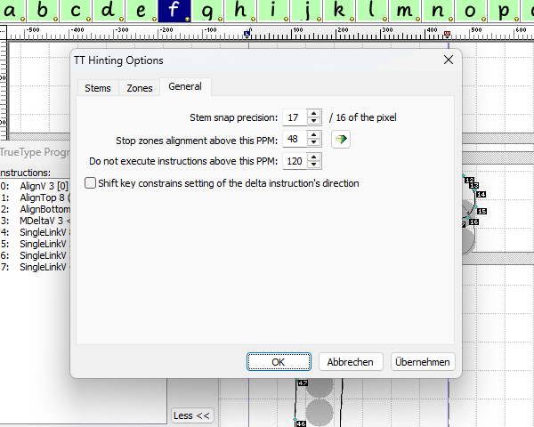

# Control Values Table and the Pre-Program

In this part, we take a look at the compiled tables from the font and correlate them to the things we see in the FLS5 UI.

## The Control Value Table

This is the control value table that FLS5 builds for the font shown in the screenshots:

<table>
    <tr><th>Index</th><th>Value</th><th>Meaning</th></tr>
    <tr><td>0</td><td>21</td><td>General: “Stop zones alignment above” value</td></tr>
    <tr><td>1</td><td>100</td><td>The 1st y stem</td></tr>
    <tr><td>2</td><td>75</td><td>The 2nd y stem</td></tr>
    <tr><td>3</td><td>110</td><td>The 1st x stem</td></tr>
    <tr><td>4</td><td>80</td><td>The 2nd x stem</td></tr>
    <tr><td>5</td><td>6</td><td>Position of the 1st bottom zone (b: 0, baseline)</td></tr>
    <tr><td>6</td><td>51</td><td>Height of the 1st bottom zone (b: 0, baseline)</td></tr>
    <tr><td>7</td><td>-406</td><td>Position of the 2nd bottom zone (b: 1, descender)</td></tr>
    <tr><td>8</td><td>39</td><td>Height of the 2nd bottom zone (b: 1, descender)</td></tr>
    <tr><td>9</td><td>494</td><td>Position of the 1st top zone (t: 0, x-height)</td></tr>
    <tr><td>10</td><td>29</td><td>Height of the 1st top zone (t: 0, x-height)</td></tr>
    <tr><td>11</td><td>721</td><td>Position of the 2nd top zone (t: 1, cap height)</td></tr>
    <tr><td>12</td><td>28</td><td>Height of the 2nd top zone (t: 1, cap height)</td></tr>
    <tr><td>13</td><td>767</td><td>Position of the 3rd top zone (t: 2, ascender)</td></tr>
    <tr><td>14</td><td>23</td><td>Height of the 1st 3rd zone (t: 2, ascender)</td></tr>
</table>

The “Stop zones alignment above” CVT value is calculated by dividing the units per em of the font by the value from the General tab, rounded up: 1000 / 48 = 20.8

## The Pre-Program

<table>
    <tr><th>Instruction</th><th>Meaning</th><th>Stack</th></tr>
    <tr><td>PUSHW[ ]</td><td>1 value pushed</td></tr>
    <tr><td>0</td><td><em>function index</em></td>                     <td>0</td></tr>
    <tr><td>CALL[ ]</td><td><a href="fdef0.md">CallFunction 0</a></td> <td>—</td></tr>
    <tr><td>SVTCA[0]</td><td>SetFPVectorToAxis</td></tr>
    <tr><td>PUSHW[ ]</td><td>3 values pushed</td></tr>
    <tr><td>1</td><td><em>y-stems start at CVT index 1</em></td>       <td>1</td></tr>
    <tr><td>2</td><td><em>number of y-stems is 2</em></td>             <td>1 2</td></tr>
    <tr><td>2</td><td><em>function index</em></td>                     <td>1 2 2</td></tr>
    <tr><td>CALL[ ]</td><td><a href="fdef2.md">CallFunction 2</a></td> <td>—</td></tr>
    <tr><td>SVTCA[1]</td><td>SetFPVectorToAxis</td></tr>
    <tr><td>PUSHW[ ]</td><td>3 values pushed</td></tr>
    <tr><td>3</td><td><em>x-stems start at CVT index 3</em></td>       <td>3</td></tr>
    <tr><td>2</td><td><em>number of x-stems is 2</em></td>             <td>3 2</td></tr>
    <tr><td>2</td><td><em>function index</em></td>                     <td>3 2 2</td></tr>
    <tr><td>CALL[ ]</td><td><a href="fdef2.md">CallFunction 2</a></td> <td>—</td></tr>
    <tr><td>SVTCA[1]</td><td>SetFPVectorToAxis</td></tr>
    <tr><td>PUSHW[ ]</td><td>8 values pushed</td></tr>
    <tr><td>3</td><td><em>CVT index of the 1st x-stem (X:110)</em></td><td>3</td></tr>
    <tr><td>52</td><td><em>ppm6 of stem</em></td>                      <td>3 52</td></tr>
    <tr><td>42</td><td><em>ppm5 of stem</em></td>                      <td>3 52 42</td></tr>
    <tr><td>33</td><td><em>ppm4 of stem</em></td>                      <td>3 52 42 33</td></tr>
    <tr><td>24</td><td><em>ppm3 of stem</em></td>                      <td>3 52 42 33 24</td></tr>
    <tr><td>14</td><td><em>ppm2 of stem</em></td>                      <td>3 52 42 33 24 14</td></tr>
    <tr><td>0</td><td><em>ppm1 of stem</em></td>                       <td>3 52 42 33 24 14 0</td></tr>
    <tr><td>8</td><td><em>function index</em></td>                     <td>3 52 42 33 24 14 0 8</td></tr>
    <tr><td>CALL[ ]</td><td><a href="fdef8.md">CallFunction 8</a></td> <td>—</td></tr>
    <tr><td>PUSHW[ ]</td><td>8 values pushed</td></tr>
    <tr><td>4</td><td><em>CVT index of the 2nd x-stem (X: 80)</em></td></tr>
    <tr><td>71</td><td><em>ppm6 of stem</em></td></tr>
    <tr><td>58</td><td><em>ppm5 of stem</em></td></tr>
    <tr><td>45</td><td><em>ppm4 of stem</em></td></tr>
    <tr><td>32</td><td><em>ppm3 of stem</em></td></tr>
    <tr><td>20</td><td><em>ppm2 of stem</em></td></tr>
    <tr><td>0</td><td><em>ppm1 of stem</em></td></tr>
    <tr><td>8</td><td><em>function index</em></td>                     <td>4 71 58  45 32 20 0 8</td></tr>
    <tr><td>CALL[ ]</td><td><a href="fdef8.md">CallFunction 8</a></td> <td>—</td></tr>
    <tr><td>SVTCA[0]</td><td>SetFPVectorToAxis</td></tr>
    <tr><td>PUSHW[ ]</td><td>8 values pushed</td></tr>
    <tr><td>1</td><td><em>CVT index of the 1st y-stem (Y: 100)</em></td></tr>
    <tr><td>55</td><td><em>ppm6 of stem</em></td></tr>
    <tr><td>45</td><td><em>ppm5 of stem</em></td></tr>
    <tr><td>35</td><td><em>ppm4 of stem</em></td></tr>
    <tr><td>27</td><td><em>ppm3 of stem</em></td></tr>
    <tr><td>16</td><td><em>ppm2 of stem</em></td></tr>
    <tr><td>0</td><td><em>ppm1 of stem</em></td></tr>
    <tr><td>8</td><td><em>function index</em></td>                     <td>1 55 45 35 27 16 0 8</td></tr>
    <tr><td>CALL[ ]</td><td><a href="fdef8.md">CallFunction 8</a></td> <td>—</td></tr>
    <tr><td>SVTCA[0]</td><td>SetFPVectorToAxis</td></tr>
    <tr><td>PUSHW[ ]</td><td>8 values pushed</td></tr>
    <tr><td>2</td><td><em>CVT index of the 2nd y-stem (Y: 75)</em></td></tr>
    <tr><td>76</td><td><em>ppm6 of stem</em></td></tr>
    <tr><td>62</td><td><em>ppm5 of stem</em></td></tr>
    <tr><td>48</td><td><em>ppm4 of stem</em></td></tr>
    <tr><td>35</td><td><em>ppm3 of stem</em></td></tr>
    <tr><td>21</td><td><em>ppm2 of stem</em></td></tr>
    <tr><td>0</td><td><em>ppm1 of stem</em></td></tr>
    <tr><td>8</td><td><em>function index</em></td>                     <td>2 76 62 48 35 21 0 8</td></tr>
    <tr><td>CALL[ ]</td><td><a href="fdef8.md">CallFunction 8</a></td> <td>—</td></tr>
    <tr><td>SVTCA[0]</td><td>SetFPVectorToAxis</td></tr>
    <tr><td>PUSHW[ ]</td><td>3 values pushed</td></tr>
    <tr><td>5</td><td><em>zones start at CVT index</em></td></tr>
    <tr><td>5</td><td><em>number of zones</em></td></tr>
    <tr><td>7</td><td><em>function index</em></td>                     <td>5 5 7</td></tr>
    <tr><td>CALL[ ]</td><td><a href="fdef7.md">CallFunction 7</a></td> <td>15</td></tr>
    <tr><td>PUSHW[ ]</td><td>1 value pushed</td></tr>
    <tr><td>0</td><td><em>CVT index of “Stop zones alignment above” value</em></td><td>15 0</td></tr>
    <tr><td>DUP[ ]</td><td>DuplicateTopStack</td>                      <td>15 0 0</td></tr>
    <tr><td>RCVT[ ]</td><td>ReadCVT</td>                               <td>15 0 zones_stop</td></tr>
    <tr><td>RDTG[ ]</td><td>RoundDownToGrid</td></tr>
    <tr><td>ROUND[01]</td><td>Round</td>                               <td>15 0 round(zones_stop)</td></tr>
    <tr><td>RTG[ ]</td><td>RoundToGrid</td></tr>
    <tr><td>WCVTP[ ]</td><td>WriteCVTInPixels</td>                     <td>15</td></tr>
    <tr><td>MPPEM[ ]</td><td>MeasurePixelPerEm</td>                    <td>15 ppm</td></tr>
    <tr><td>PUSHW[ ]</td><td>1 value pushed</td></tr>
    <tr><td>120</td><td><em>General: “Do not execute instructions above this PPM”</em></td><td>15 ppm 120</td></tr>
    <tr><td>GT[ ]</td><td>GreaterThan</td><td>15 ppm>120</td></tr>
    <tr><td>IF[ ]</td><td>If</td></tr>
    <tr><td>    PUSHB[ ]</td><td>1 value pushed</td></tr>
    <tr><td>    1</td><td></td><td>15 1</td></tr>
    <tr><td>ELSE[ ]</td><td>Else</td></tr>
    <tr><td>    PUSHB[ ]</td><td>1 value pushed</td></tr>
    <tr><td>    0</td><td></td><td>15 0</td></tr>
    <tr><td>EIF[ ]</td><td>EndIf</td></tr>
    <tr><td>PUSHB[ ]</td><td>1 value pushed</td></tr>
    <tr><td>1</td><td></td><td>15 1|0 1</td></tr>
    <tr><td>INSTCTRL[ ]</td><td>SetInstrExecControl</td><td>15</td></tr>
</table>

> There remains a value on the stack, the index of the next “free” CVT index after the zones.

> The zone heights are stored in the CVT table, and are rounded by the functions, but are not used by the font’s programs at all.
